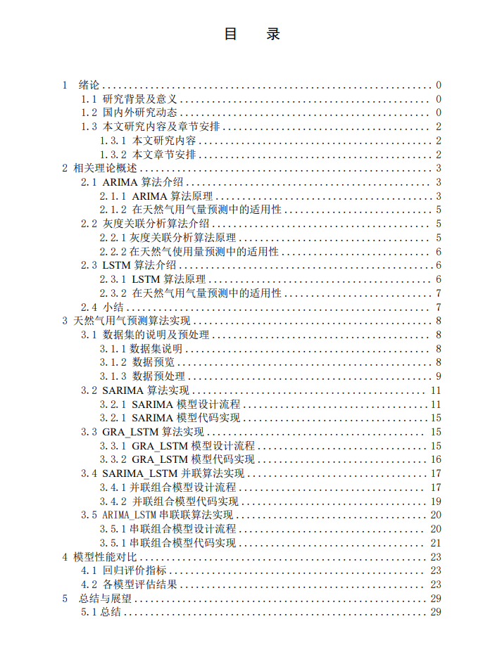
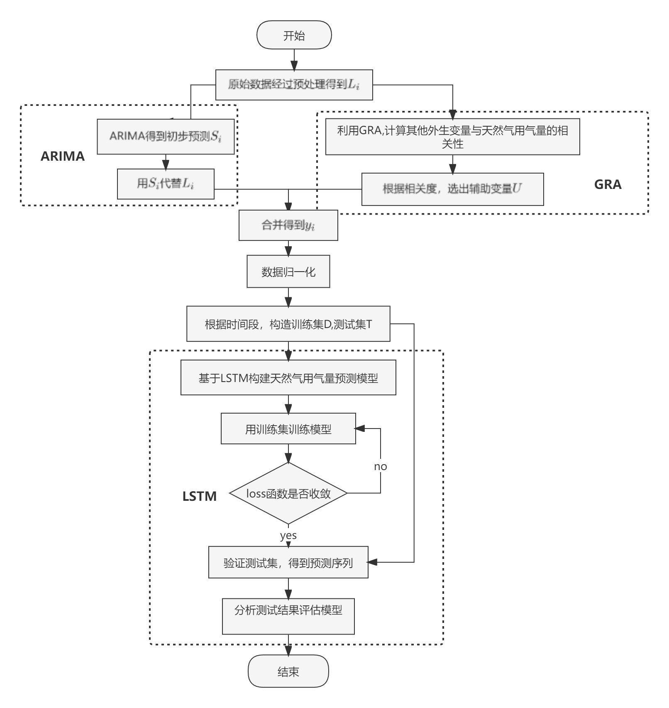

**简体中文 | [English](README_EN.md)**

## 本科毕业设计

**演示：**

**目的**：对天然气用气量，进行预测。

**数据集**：数据集为采集得到的天然气用气量（这里没有上传，需要换成自己的数据集）。

**工作内容**：尝试对比ARIMA、LSTM、SARIMA、GRA_LSTM、SARIMA_LSTM串联模型和SARIMA_LSTM并联模型在该数据集下的表现力。

**论文目录**：

**模型**

- LSTM

- GRA_LSTM

- 串联

- 并联

