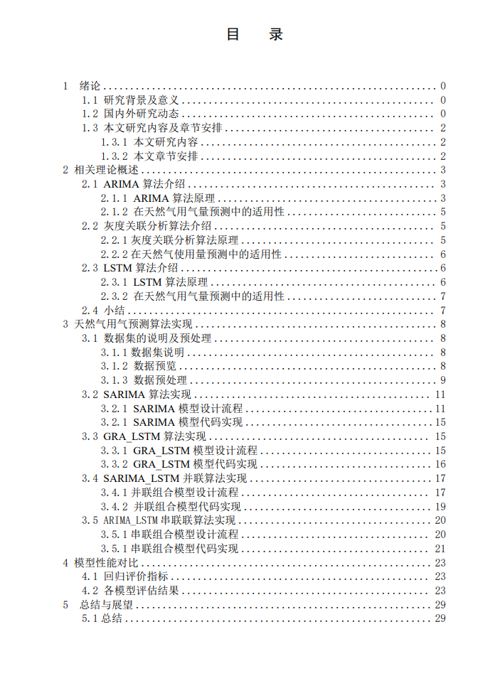
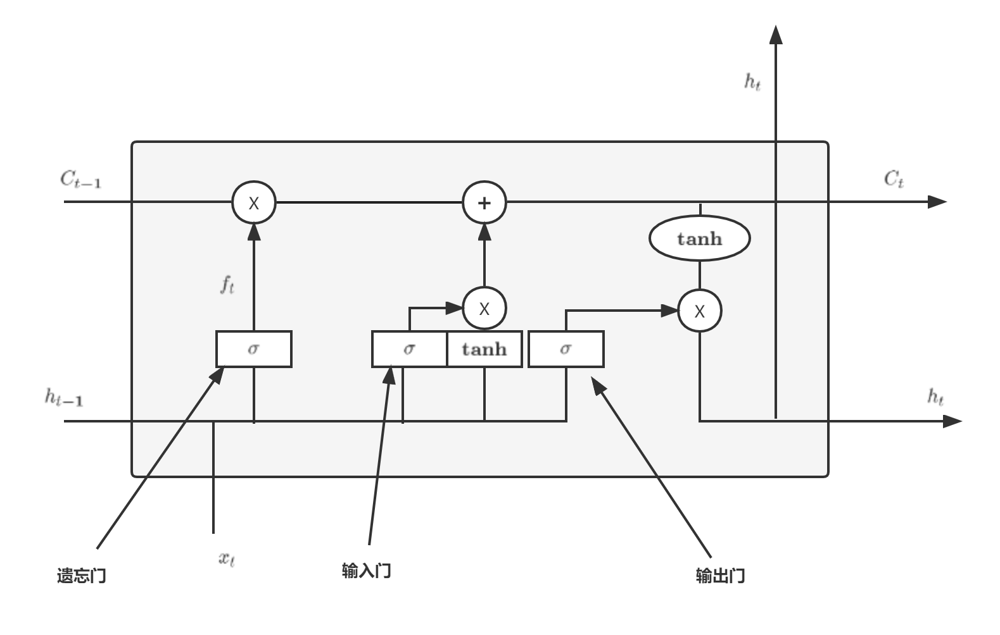
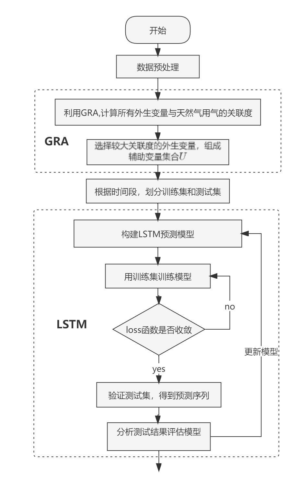
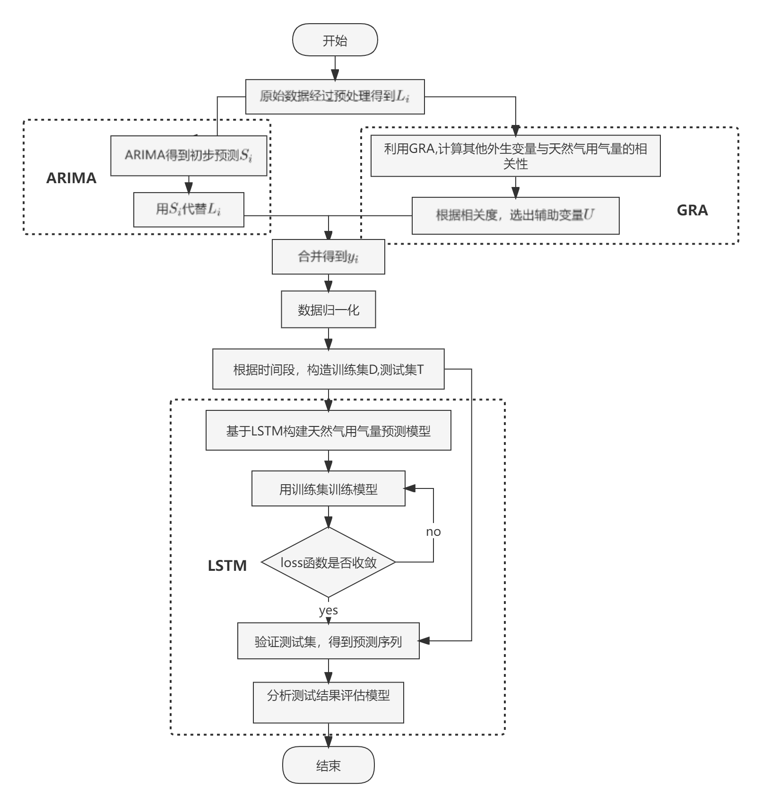
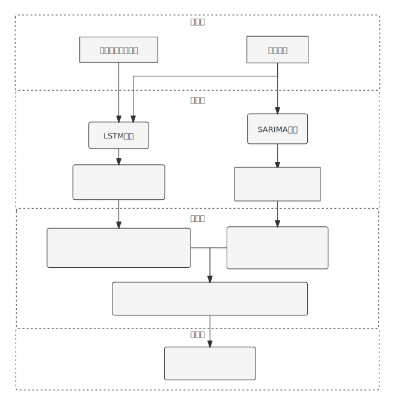

English | [简体中文](README.md)

## Undergraduate Graduation Project

**demonstration **：

**Objective** : To predict the amount of natural gas consumption.

**Dataset** : The dataset is the collected gas consumption (not uploaded here, we need to replace it with our own dataset).

**What I do** : Try to compare the performance of ARIMA, LSTM, SARIMA, GRA_LSTM, SARIMA_LSTM series model and SARIMA_LSTM parallel model on this dataset.

**Table of Papers **:

**Models**

- LSTM

- GRA_LSTM

- cascade

- parallel

